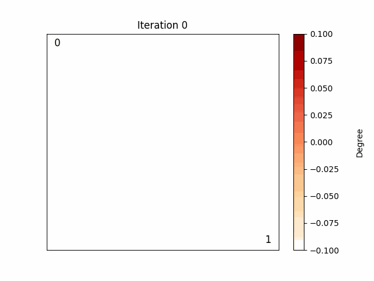

# Modelo de Barabási-Albert ("*Rich gets richer*")

O modelo de Barabási-Albert descreve o crescimento de um grafo inicial V0, no qual se acrescenta, a cada iteração, um novo nó e uma aresta entre este e um nó do grafo prévio, priorizando nós com maior *grau* (isto é, nós mais "populares"). 

	

	

