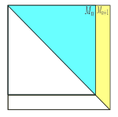
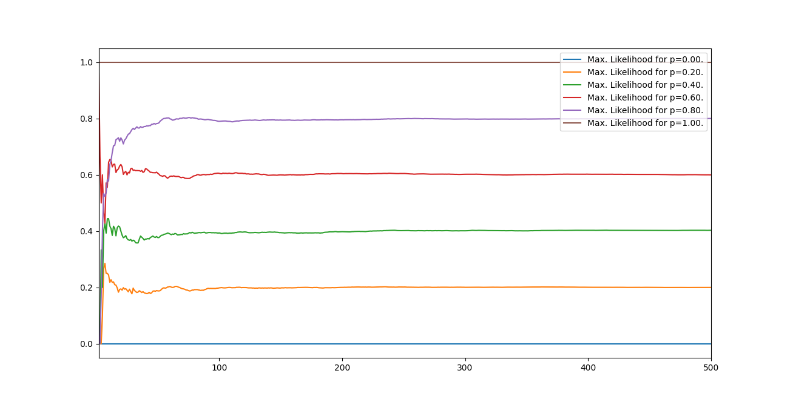
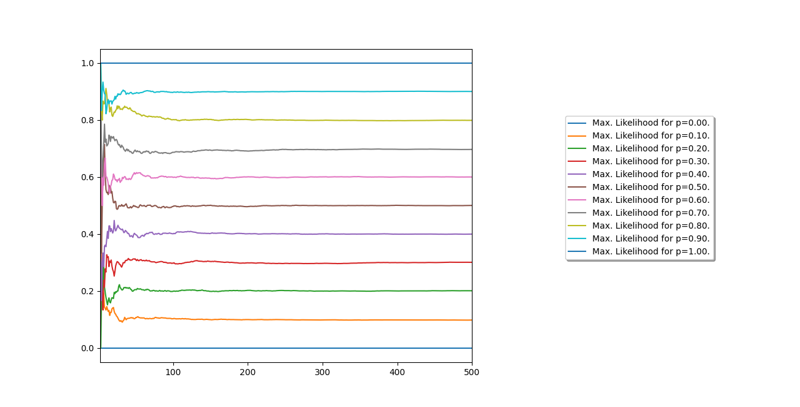

# Grafos de Erdős-Rényi

Dada uma população de *N* agentes e uma probabilidade *0 < p < 1*, então para todos os pares distintos *(i,j)*  adicionamos uma aresta entre estes agentes com probabilidade *p*. Seguem abaixo exemplos de grafos de Erdős-Rényi. 

	

## Caso Especial: Matrizes de Adjacência Encaixadas

Tenha-se uma sequência de grafos de Erdős-Rényi , definidos de tal forma que:

 
	

Ou seja, as matrizes estão encaixadas como na figura abaixo, para cada *N*:

	

Desejamos avaliar como a máxima verossimilhança evolui conforme

	

	

	

